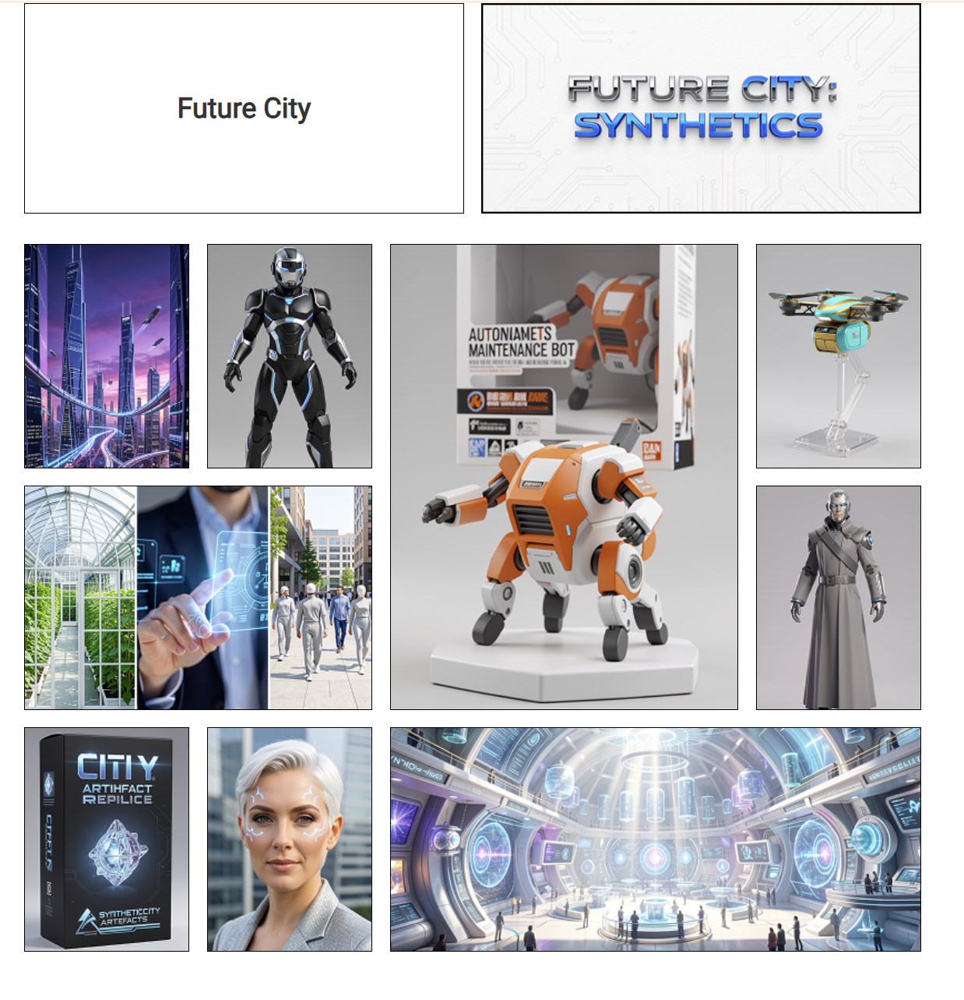

# Future City Synthetics

A CSS Grid gallery layout with a futuristic city theme.

## Screenshot

## Description

A simple image gallery page built with CSS Grid. It demonstrates how to arrange blocks with images of different aspect ratios — portrait, landscape, and square — in a responsive grid layout.

## Tech Stack

- HTML5
- CSS3 (Grid Layout)
- Font: Roboto (Google Fonts)